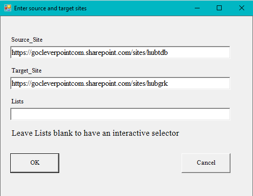
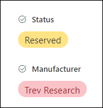

# Move-Lists
Easily move SharePoint Online list templates from one site to another.

Interactive selector of lists and libraries:

Migrates list item formatting:

## Getting started

- Download the latest version of the Move-Lists package.
- Unzip on disk.
- Run `Move-Lists.bat` file.
- Select source SharePoint Online site.
- Select destination SharePoint Online site.
- Select one or more Lists or Libraries to migrate.
- Sit back and watch your lists and libraries migrated.

## Limitations
Move-Lists script does not migrate data. Lists and libraries will be empty. 