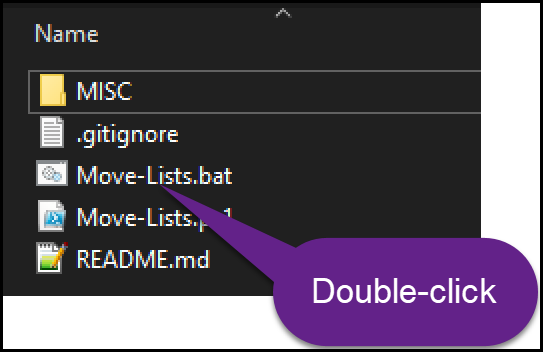
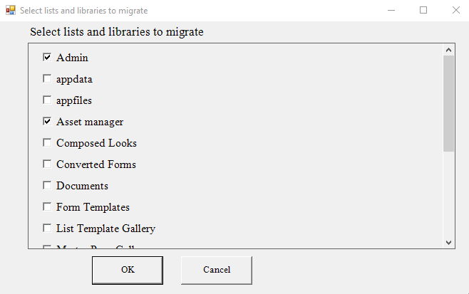
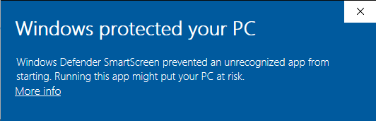

 


# Move-Lists

Easily move SharePoint Online list templates from one site to another.

## Prerequisites

- Launch PowerShell
- Run the following command:
```
Set-ExecutionPolicy Unrestricted -Scope CurrentUser
```

## Migratable artifacts

| Artifact      | Support |
| ----------- | ----------- |
| SharePoint Lists   | ✔        |
| SharePoint Libraries   | ✔        |
| Modern JSON List customizations  | ✔        |
| Content Types   | ✔ (migrated automatically, if a list contains any)     |
| SharePoint data   | ❌       |
| Lookup fields   | ❌        |
| Lists located in a single site  | ✔        |
| Lists located in multiple sites and subsites   | ❌        |

## Move SharePoint Lists

- Download the [latest version of the Move-Lists package](https://github.com/Zerg00s/Move-Lists/releases).
- Unzip on disk.
- Run `Move-Lists.bat` file.



- Select source SharePoint Online site.
- Select destination SharePoint Online site.


- Select one or more Lists or Libraries to migrate.



- Sit back and watch your lists and libraries migrate.

## Windows Defender Smartscreen:
Windows Defender will display a security warning when you attempt to run scripts downloaded from the Internet.



To avoid this warning:

1. Right click on the `Move-Lists.bat` file and open the Properties window from the contextual menu.
2. At the bottom of the "General" tab, you should see a "Security" section with an "Unblock" checkbox or button. Click on the button or check the box.
3. Click OK.
4. You should now be able to execute the BAT file without warning.

## Limitations
- The script is portable. There is no need to install any PowerShell modules.
- Only SharePoint Online is supported.
- Move-Lists script does not migrate data. Lists and libraries will be empty. 
- macOS and Linux are not supported.
- Does not require local admin privileges.
- Requires Read permission on the Source site.
- Requires Edit permission on the Target site.

## Why would I want to use Move-Lists?
- You need to quickly move multiple lists or libraries.
- You want to migrate Power App and Power Automate flows and you need to make sure lists dependencies exist.
- You don't have a migration tool.
- You don't want or need to write a migration script.
- You don't want to manually re-create custom lists.
- You want to move lists from a DEV to a Production site.
- Migrates list item formatting:


